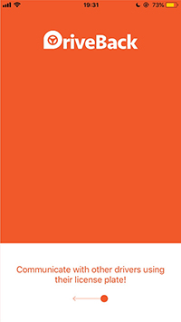

# DriveBack

DriveBack is an iOS app that allows people to communicate anonymously through license plates. This has several use cases:
- Communicating between cars during a road trip
- Warning a car owner of damage/blown tire, etc.
- Road rage (unintended)

## Screens:

The inspiration for this project came from a tweet. A quick search on Twitter returned a different tweet, but with the same idea. 

## Client

The iOS app was built in Swift using Xcode, here are some highlights:
- Custom UI elements - UITextField, StoryboardSegue
- SocketManager to handle WebSocket connections
- TableViewController to display messages
- Key-Value Store to store user data

## Server

The server was built primarily using Node.js, here are some highlights:
- Socket.io for real time communication
- Firebase Cloud Firestore to store messages and license 
- Messaging data is preserved even if a car owner has not signed up - upon signing up, all past messages are received
